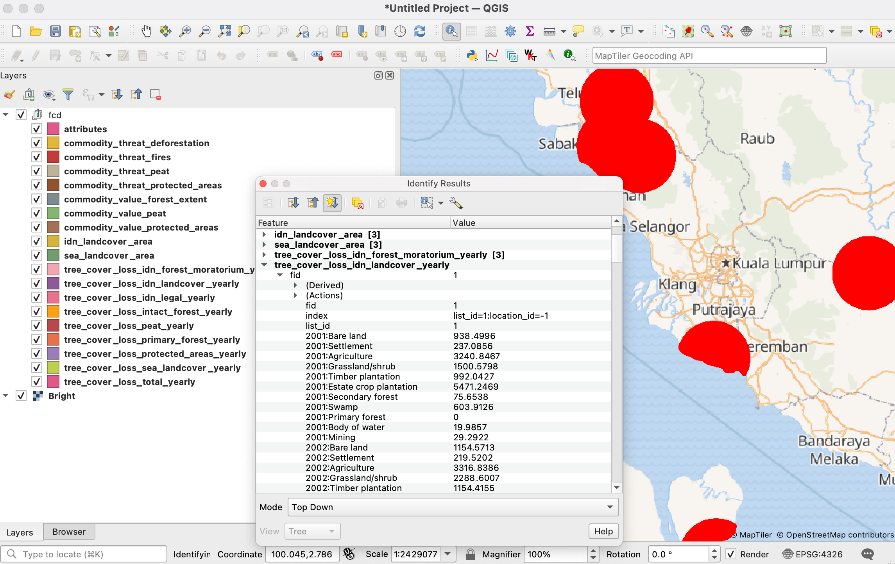

# wri_list_tools
Python tools for analyzing list of input features and outputs from [gfw_forest_loss_geotrellis](https://github.com/wri/gfw_forest_loss_geotrellis).

## Input Lists

Input lists have `list_id`, `location_id`, `geom` columns, they correspond to user.
These can be read into GeoPandas dataframe

```python
In [6]: from wri_list_tools import read_list_tsv
   ...:
   ...: read_list_tsv("tests/palm-generic-32.tsv")
Out[6]:
             list_id                                           geometry
location_id
 1                 1  POLYGON ((80.44360 6.01474, 80.43591 6.00847, ...
 2                 1  POLYGON ((99.50002 7.93557, 99.49631 7.92656, ...
 3                 1  MULTIPOLYGON (((98.91782 8.04344, 98.91676 8.0...
 4                 1  MULTIPOLYGON (((98.91782 8.04344, 98.91676 8.0...
```

## Job Outputs

Job outputs from [gfw_forest_loss_geotrellis](https://github.com/wri/gfw_forest_loss_geotrellis) also come in TSV format, written by spark into `final` subdir of job output directory.  They can be read into Pandas DataFrame:

```python
In [10]: from wri_list_tools import read_job_output
In [11]: job_df = read_job_output("tests/fcd_output")

In [12]: job_df
Out[12]:
    list_id  location_id  ...                   commodity_threat_protected_areas                             commodity_threat_fires
0         1           26  ...  {"2002":634.7188,"2003":635.1781,"2004":636.63...  {"2001":7.5,"2002":9.5,"2003":13.5,"2004":20.0...
1         1            2  ...  {"2002":16.4619,"2003":29.6455,"2004":42.2971,...  {"2002":25.0,"2003":53.0,"2004":59.5,"2005":79...
2         1           14  ...  {"2002":4603.0059,"2003":4603.0058,"2004":4603...  {"2001":18.0,"2002":28.0,"2003":25.5,"2004":31...
3         1           11  ...  {"2002":0.0,"2003":0.0,"2004":0.0,"2005":0.0,"...  {"2002":103.5,"2003":163.0,"2004":125.0,"2005"...
4         1           15  ...  {"2002":367.2074,"2003":375.3591,"2004":352.59...  {"2001":37.5,"2002":485.5,"2003":843.0,"2004":...

[33 rows x 46 columns]
```

This is nice but as you can see some of the columns are histograms of yearly values encoded as JSON. These are hard to make use of.
Each JSON column can be expanded into a "flat" dataframe

```python
In [15]: from wri_list_tools import expand_dic_col

In [16]: col = job_df["commodity_threat_protected_areas"].map(json.loads)

In [17]: col
Out[17]:
0     {'2002': 634.7188, '2003': 635.1781, '2004': 6...
1     {'2002': 16.4619, '2003': 29.6455, '2004': 42....
2     {'2002': 4603.0059, '2003': 4603.0058, '2004':...
3     {'2002': 0.0, '2003': 0.0, '2004': 0.0, '2005'...
4     {'2002': 367.2074, '2003': 375.3591, '2004': 3...
Name: commodity_threat_protected_areas, dtype: object

In [18]: expand_dic_col(col, ['year'], 'acres')
Out[18]:
             acres
   year
0  2002   634.7188
1  2002    16.4619
2  2002  4603.0059
3  2002     0.0000
4  2002   367.2074
...            ...
28 2019     0.0000
29 2019    29.2045
30 2019     0.0000
31 2019  1825.2936
32 2019     0.0000

[594 rows x 1 columns]
```

## Expanded Job Outputs

Given 46 columns in ForestChangeDiagnostic output some columns are nested and some are not.
This information is encoded in the wrapper class that can apply the right transformation.
It acts like a dictionary of per-column dataframes:

```python
In [19]: from wri_list_tools import ForestChangeDiagnostic

In [20]: fcd = ForestChangeDiagnostic("tests/fcd_output")

In [21]: list(fcd.keys())
Out[21]:
['index',
 'list_id',
 'status_code',
 'location_error',
 'tree_cover_loss_total_yearly',
 'tree_cover_loss_primary_forest_yearly',
 'tree_cover_loss_peat_yearly',
 'tree_cover_loss_intact_forest_yearly',
 'tree_cover_loss_protected_areas_yearly',
 'tree_cover_loss_sea_landcover_yearly',
 'tree_cover_loss_idn_landcover_yearly',
 'tree_cover_loss_soy_yearly',
 'tree_cover_loss_idn_legal_yearly',
 'tree_cover_loss_idn_forest_moratorium_yearly',
 'tree_cover_loss_prodes_yearly',
 'tree_cover_loss_prodes_wdpa_yearly',
 'tree_cover_loss_prodes_primary_forest_yearly',
 'tree_cover_loss_brazil_biomes_yearly',
 'tree_cover_extent_total',
 'tree_cover_extent_primary_forest',
 'tree_cover_extent_protected_areas',
 'tree_cover_extent_peat',
 'tree_cover_extent_intact_forest',
 'natural_habitat_primary',
 'natural_habitat_intact_forest',
 'total_area',
 'protected_areas_area',
 'peat_area',
 'brazil_biomes',
 'idn_legal_area',
 'sea_landcover_area',
 'idn_landcover_area',
 'idn_forest_moratorium_area',
 'south_america_presence',
 'legal_amazon_presence',
 'brazil_biomes_presence',
 'cerrado_biome_presence',
 'southeast_asia_presence',
 'indonesia_presence',
 'commodity_value_forest_extent',
 'commodity_value_peat',
 'commodity_value_protected_areas',
 'commodity_threat_deforestation',
 'commodity_threat_peat',
 'commodity_threat_protected_areas',
 'commodity_threat_fires']

In [23]: fcd['tree_cover_loss_total_yearly']
Out[23]:
                  tree_cover_loss_total_yearly
location_id year
26          2001                     2055.8131
2           2001                      777.0302
14          2001                     4138.8128
11          2001                     3399.9531
15          2001                      824.4761
...                                        ...
9           2020                     2241.1601
13          2020                     1068.4284
8           2020                     2345.9443
25          2020                     4122.2197
24          2020                     1034.1295

[660 rows x 1 columns]

In [24]: fcd['tree_cover_loss_idn_landcover_yearly']
Out[24]:
                            tree_cover_loss_idn_landcover_yearly
location_id landocver year
 11         Bare land 2001                              610.3934
 15         Bare land 2001                              102.5131
 7          Bare land 2001                                0.8446
 29         Bare land 2001                                6.1497
 31         Bare land 2001                                3.8428
...                                                          ...
            Mining    2020                                0.4611
-1          Mining    2020                                8.0742
 28         Mining    2020                                0.5383
 20         Mining    2020                                2.9997
 9          Mining    2020                                1.0001

[2360 rows x 1 columns]
```

Those attributes that don't need expanded are accessible as a simple table:

```python
In [27]: fcd.attributes_df().columns
Out[27]:
Index(['index', 'list_id', 'status_code', 'location_error',
       'tree_cover_extent_total', 'tree_cover_extent_primary_forest',
       'tree_cover_extent_protected_areas', 'tree_cover_extent_peat',
       'tree_cover_extent_intact_forest', 'natural_habitat_primary',
       'natural_habitat_intact_forest', 'total_area', 'protected_areas_area',
       'peat_area', 'brazil_biomes', 'idn_legal_area',
       'idn_forest_moratorium_area', 'south_america_presence',
       'legal_amazon_presence', 'brazil_biomes_presence',
       'cerrado_biome_presence', 'southeast_asia_presence',
       'indonesia_presence'],
      dtype='object')
```

## Export to CSV
Flat views are suited to being imported into Excel for manual inspection:

```python
In [28]: fcd.to_csv_dir("/tmp/fcd-out")
/tmp/fcd-out/tree_cover_loss_total_yearly.csv
/tmp/fcd-out/tree_cover_loss_primary_forest_yearly.csv
/tmp/fcd-out/tree_cover_loss_peat_yearly.csv
/tmp/fcd-out/tree_cover_loss_intact_forest_yearly.csv
/tmp/fcd-out/tree_cover_loss_protected_areas_yearly.csv
/tmp/fcd-out/tree_cover_loss_sea_landcover_yearly.csv
/tmp/fcd-out/tree_cover_loss_idn_landcover_yearly.csv
/tmp/fcd-out/tree_cover_loss_soy_yearly.csv
/tmp/fcd-out/tree_cover_loss_idn_legal_yearly.csv
/tmp/fcd-out/tree_cover_loss_idn_forest_moratorium_yearly.csv
/tmp/fcd-out/tree_cover_loss_prodes_yearly.csv
/tmp/fcd-out/tree_cover_loss_prodes_wdpa_yearly.csv
/tmp/fcd-out/tree_cover_loss_prodes_primary_forest_yearly.csv
/tmp/fcd-out/tree_cover_loss_brazil_biomes_yearly.csv
/tmp/fcd-out/sea_landcover_area.csv
/tmp/fcd-out/idn_landcover_area.csv
/tmp/fcd-out/commodity_value_forest_extent.csv
/tmp/fcd-out/commodity_value_peat.csv
/tmp/fcd-out/commodity_value_protected_areas.csv
/tmp/fcd-out/commodity_threat_deforestation.csv
/tmp/fcd-out/commodity_threat_peat.csv
/tmp/fcd-out/commodity_threat_protected_areas.csv
/tmp/fcd-out/commodity_threat_fires.csv
DONE!
```

## Export to GPKG

For visual inspection the geometries from the input TSV can be combined with the result attributes to be saved to GPKG.
Each nested column gets its own layer and the attributes are flattened to be readable in QGIS:

```python
In [1]: from wri_list_tools import ForestChangeDiagnostic, read_list_tsv

In [2]: input_df = read_list_tsv("tests/palm-generic-32.tsv")

In [3]: fcd = ForestChangeDiagnostic("tests/fcd_output")

In [4]: fcd.to_gpkg("/tmp/fcd.gpkg", input_df)
```
